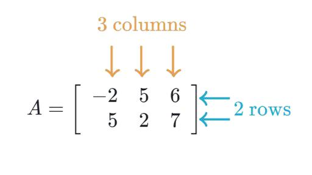

# Vectors & Matrix

### Learning Objectives

* Vector
* Matrix

### Vector

* A vector, in programming, is a type of array that is one dimensional.

### Dimensions

**Now, what are dimensions? **- Let’s take an example of** **box to explain this. A box has three dimensions width, length and depth (or height). Similarly, in data science we working “N” dimensional datasets. “N” could be any number.

.png>)

### Vector

* One dimensional array is a vector.
* For example, \[1, 2, 3, 4, 5] is a vector.

### Matrix

* Matrix is an arrangement of numbers into rows and columns

.png>)

* The matrix A has two rows and three columns

### Shape of Matrix

* Since matrix A has two rows and three columns, we write its shape as 2 X 3, pronounced as ‘two by three’

### Dimension of Matrix

* The shape of matrix also tells you it’s dimensions. The dimension of matrix A is 2 as its shape is 2 X 3.
* If a matrix has its shape as 2 X 3 X 2 (say for example), the dimension of the matrix would be 3.
* Don’t worry if you don’t get this point. You will make it as you go along

.png>)

### Matrix

* Matrix B has three rows and two columns, so it is a 3 X 2 matrix

* Whenever you are working with matrix shape, remember rows X columns
